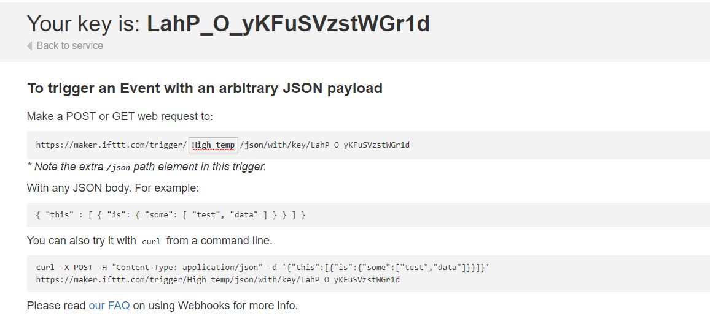
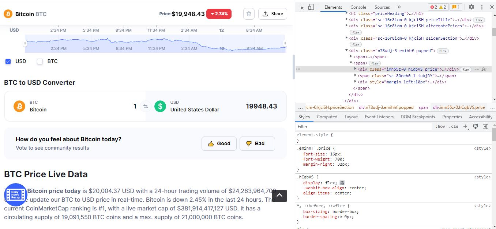
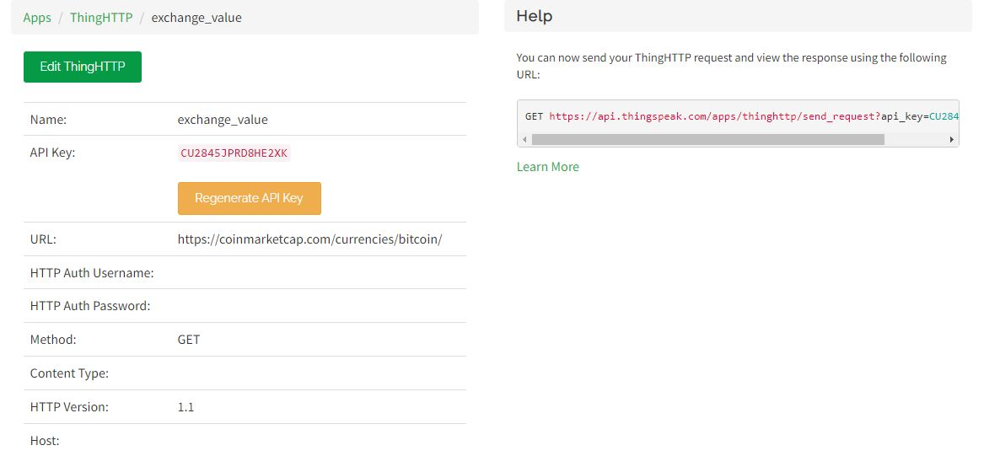
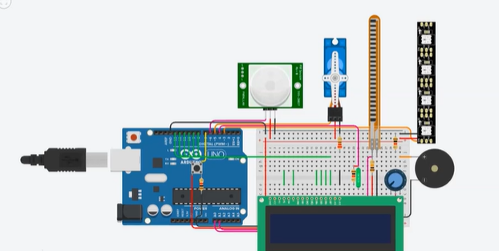
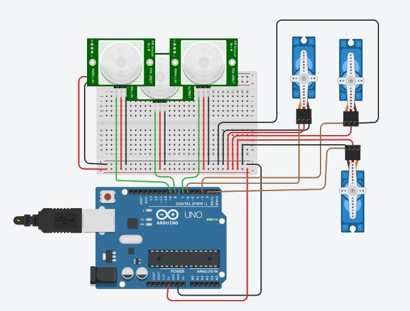
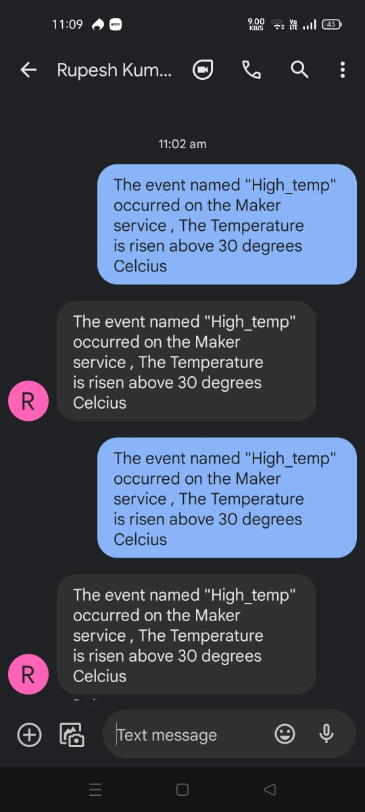

# Internship - Internet of Things (IoT)

I have completed my internship in association with Simple Learn and IIT Tirupati from **1/5/2022** to **30/6/2022**. During this period, I gained hands-on experience in the field of Internet of Things (IoT) and successfully completed the assigned projects.

## Major Project - Task1: IOT Based System Using ThingSpeak and IFTTT

The objective of this project was to build an IoT-based system using ThingSpeak and IFTTT. The system utilized react triggers, webhooks, and SMS integration to connect with a mobile phone. The project involved creating a ThingSpeak HTTP request for either cricket scores or share prices of any shares.

## Task2: IoT System Using ThingSpeak, IFTTT, and Tinkercad

In this task, I built an IoT-based system using ThingSpeak, IFTTT, and Tinkercad. The system involved creating a channel to read two different sensor values, setting up a react trigger, and connecting it to IFTTT using a webhook. The objective was to send a notification message to a mobile phone through SMS. Screenshots of the entire process were taken and attached to a Word file as part of the project submission.

## Tinkercad Project

For the Tinkercad project, I built a system using 3 servos and 3 sensors. When each sensor was activated, the corresponding servo would operate at a 45-degree angle. It's worth mentioning that no hardware was used in any of the above tasks, and the required data was collected from various sources on the internet.

 

## Learning and Experience

During this internship, I acquired knowledge about the layers of IoT, ATMega328p, architecture and block design, working of MQTT, and more. I worked with Arduino, ESP8266, and various sensors, gaining practical experience in sensor integration, actuators, Zigbee, APIs, transfer protocols, LAN Cloud, and automation of applications using platforms like ThingSpeak, IFTTT, and Tinkercad. I developed applications that sent data over the cloud, enabling automation in various scenarios.

Feel free to explore the projects, code, and documentation included in this repository to gain a deeper understanding of the concepts and implementations in the IoT domain.

**Note**: The internship was conducted in collaboration with Simple Learn and IIT Tirupati, and the projects described here were successfully completed during the internship period.

